  
# Dicoding Submission: Belajar Fundamental Aplikasi Android    
 [](http://developer.android.com/index.html) [](http://kotlinlang.org) [](https://developer.android.com/studio/releases/gradle-plugin)    
    
This repository is the result of my submission in [Dicoding](https://www.dicoding.com) class [Learn Fundamental Android Application](https://www.dicoding.com/academies/14) that implements MVVM(Model View ViewModel) architecture using the components ViewModel, LiveData, Dagger2, Room, RxJava, etc.    
*Hopefully my repository can be useful to be used as a reference all friends.*
    
## Installation 
Clone this repository and import into Android Studio    
```
    https://github.com/dimas-nur/dicoding-bfaa.git
```    

## Demo    
<h3 align="center"> Search Screen </h3>
<p align="center">
    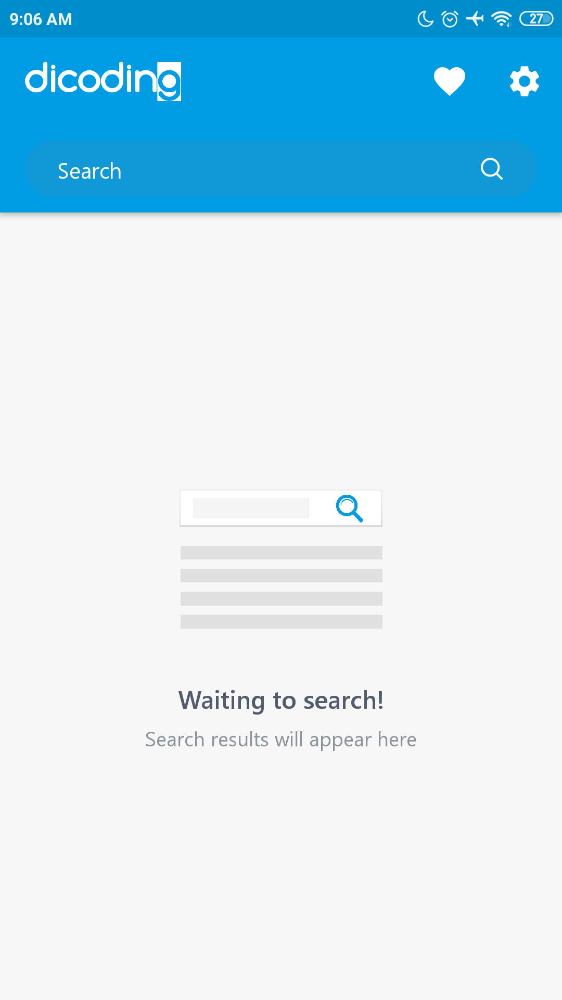
    
    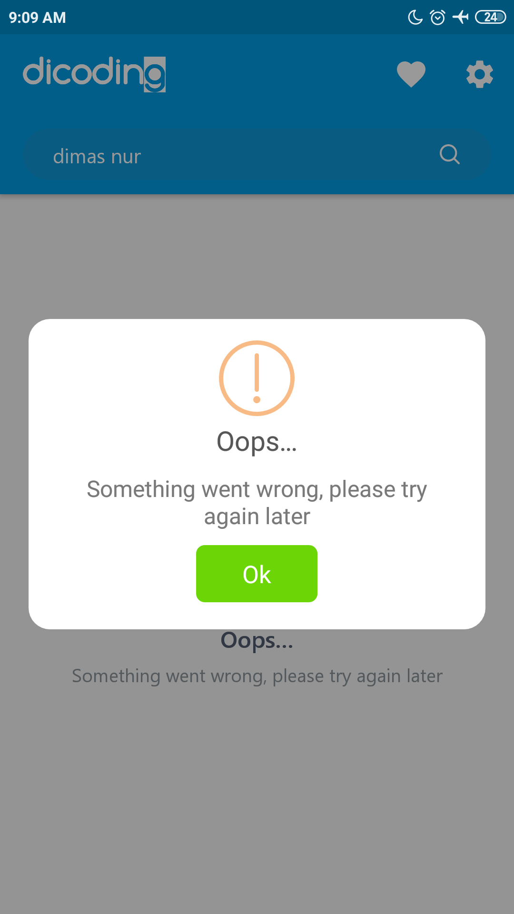
    
</p>
 
  
<h3 align="center">Notification Reminder </h3>
<p align="center">
    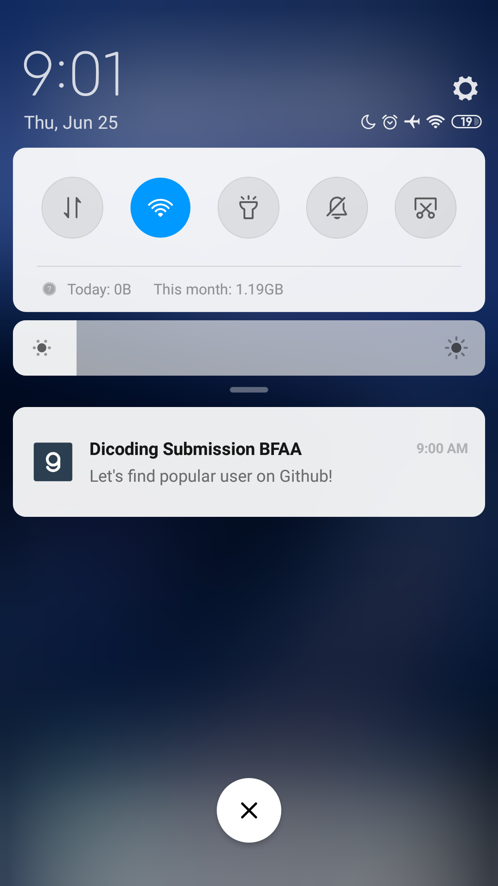
    
</p>
 
  
<h3 align="center">Profile Screen </h3>
<p align="center">
    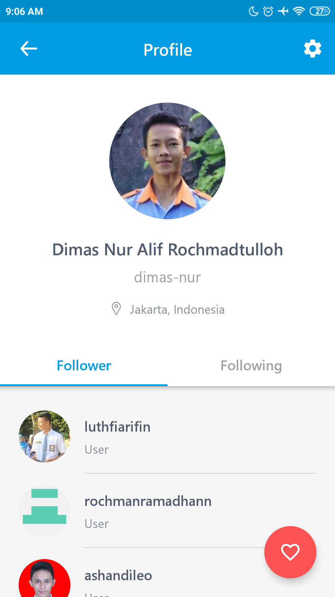
    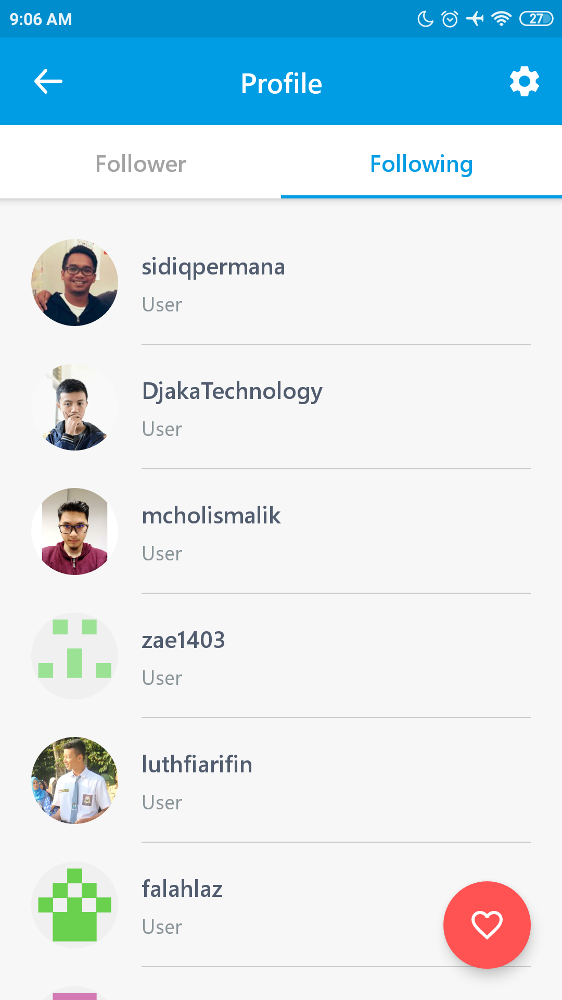
    
    
</p>
  
<h3 align="center">Favorite Screen </h3>
<p align="center">
    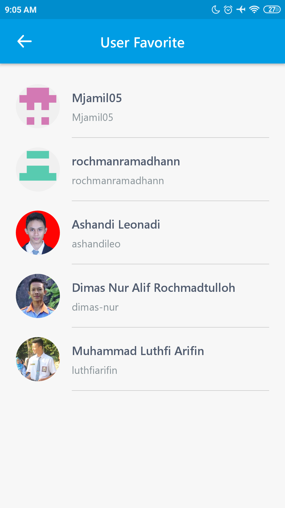
    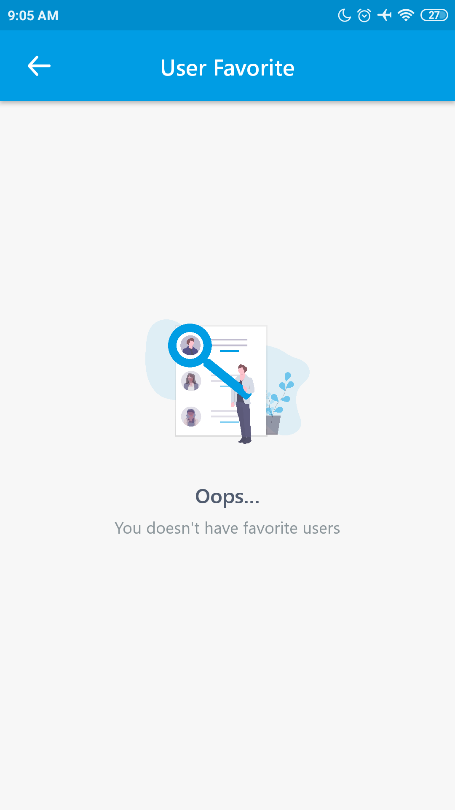
</p>
  
<h3 align="center">Setting Screen </h3>
<p align="center">
    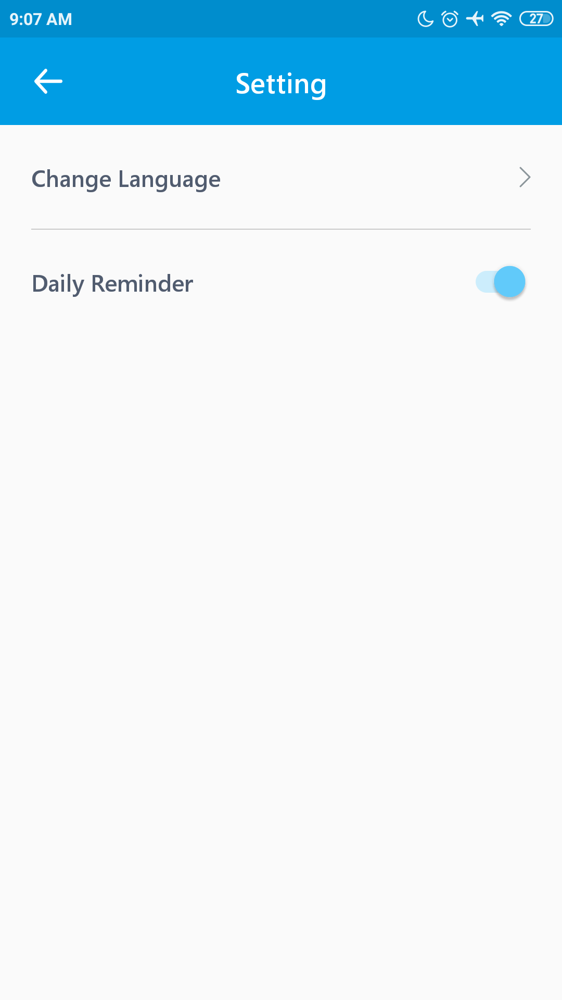
    
</p>
  
<h3 align="center">Widget </h3>
<p align="center">
    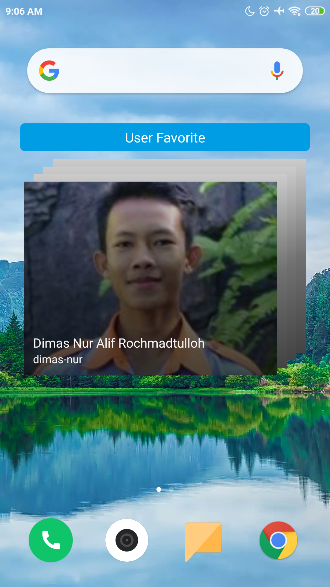
    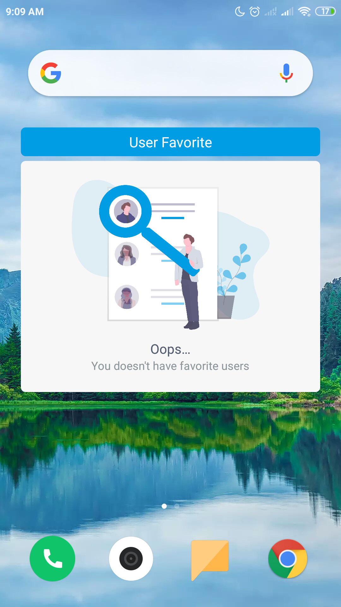
    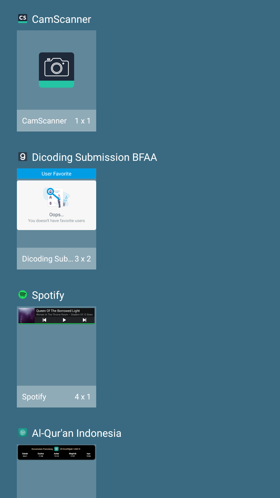
</p>
  
<h3 align="center">
  Consumer App
</h3>
<p align="center">
    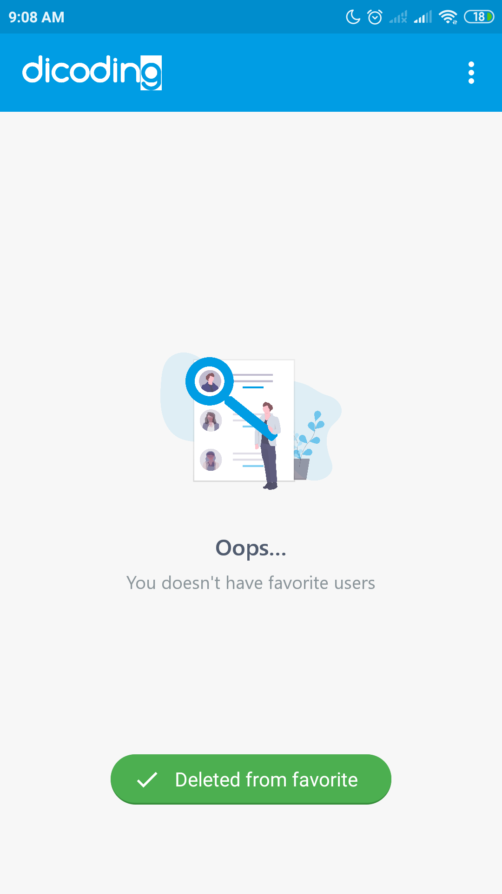
    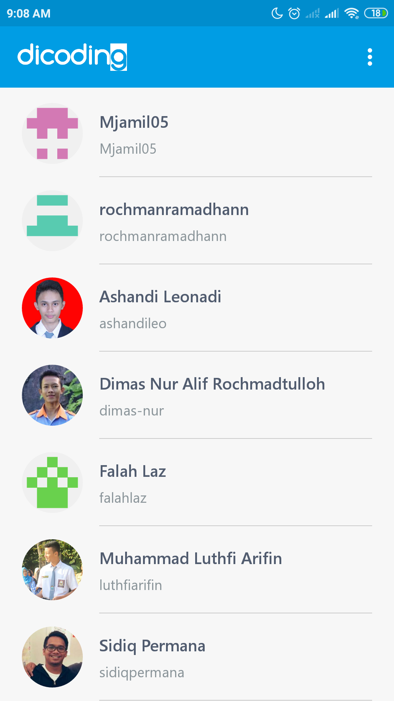
</p>

## Feature :
- Using MVVM (Model-View-ViewModel) Architecture
- Using Dagger2 as dependency injection
- Using Single activity and using navigation component to manage fragment operations
- Using localization for support Indonesian and English Language
- Using Room Persistence for local database
- Using ViewBinding & DataBinding
- Using RxJava2 to handle data flow
- Using Retrofit to request api network
- Using Glide for load and caching image from url
- There is an explanatory comment on each function, making it easier to understand the flow of the application
    
## Dependencies :
- [Lifecycle & Livedata](https://developer.android.com/jetpack/androidx/releases/lifecycle)
- [Navigation Component](https://developer.android.com/jetpack/androidx/releases/navigation)
- [Dagger 2](https://github.com/google/dagger)    
- [Retrofit 2](https://square.github.io/retrofit/)    
- [OkHttp 3](https://square.github.io/okhttp/)    
- [RxJava2](https://github.com/ReactiveX/RxJava)
- [RxKotlin2](https://github.com/ReactiveX/RxKotlin)
- [RxAndroid](https://github.com/ReactiveX/RxAndroid)
- [Glide](https://github.com/bumptech/glide)    
- [AndroidX](https://mvnrepository.com/artifact/androidx)    
- [Sweet Alert](https://github.com/F0RIS/sweet-alert-dialog)    
- [Fancy Toast](https://github.com/Shashank02051997/FancyToast-Android)    

## Pull Requests
I encourage all the developers out there to contribute to the repository and help me to expand it. To contribute just think up of an example which could be a feature or some demo to how to use a library. Develop the demo and create a pull request and you are in.

## Support me 
> Just  **star** or  **fork** this repository, and follow my github. You have *supported* me!
    
## Author
[**Dimas Nur Alif Rochmadtulloh**](https://www.linkedin.com/in/dimasnur/) - dimasnur.dev@gmail.com

## License 
```

   Copyright © 2020 Dimas Nur Alif Rochmadtulloh

   Licensed under the Apache License, Version 2.0 (the "License");
   you may not use this file except in compliance with the License.
   You may obtain a copy of the License at

       http://www.apache.org/licenses/LICENSE-2.0

   Unless required by applicable law or agreed to in writing, software
   distributed under the License is distributed on an "AS IS" BASIS,
   WITHOUT WARRANTIES OR CONDITIONS OF ANY KIND, either express or implied.
   See the License for the specific language governing permissions and
   limitations under the License.

``` 